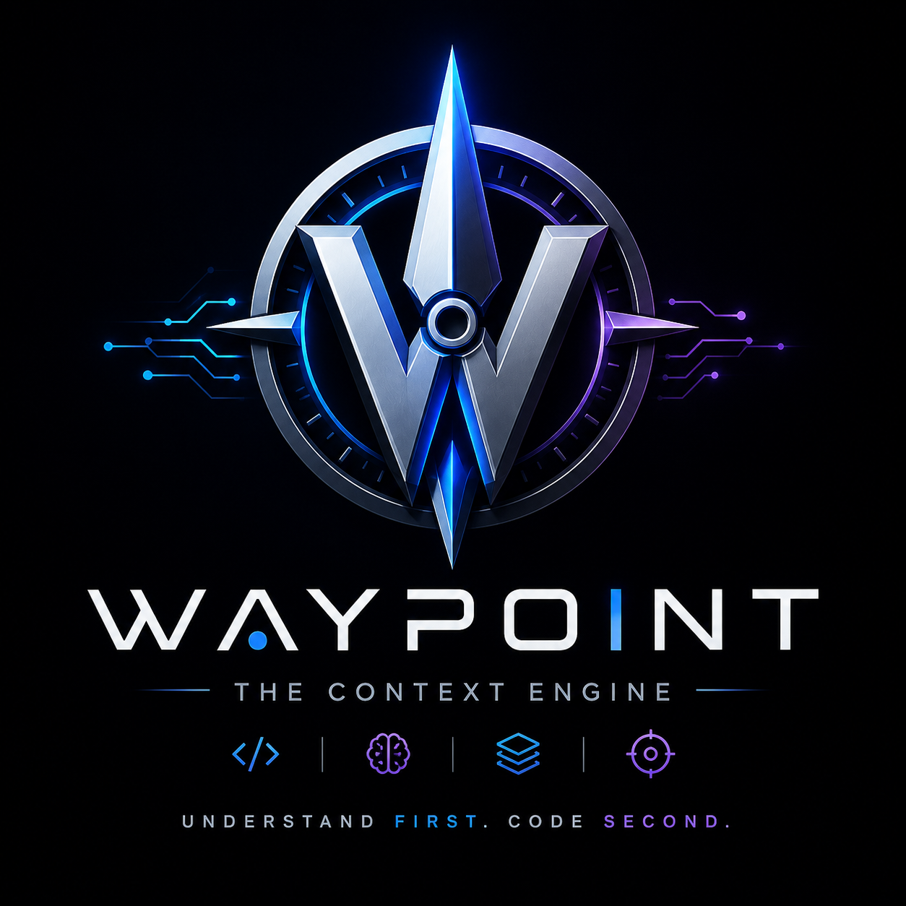

<p align="center">
  
</p>

<p align="center">
  
  
  
  
  
</p>

<h1 align="center">🧭 Waypoint</h1>
<h3 align="center"><em>The Context Engine That Prepares Developers Before They Write a Single Line of Code</em></h3>

<p align="center">
  Waypoint is an AI-powered developer productivity tool that analyzes any GitHub repository or local project and generates <strong>task-specific Mission Briefs</strong> — telling you exactly which files to touch, what traps to avoid, and the optimal execution route, <em>before you start coding</em>.
</p>

---

## 🎯 Problem Statement

When a developer joins a new codebase or picks up an unfamiliar task, they waste **30–60 minutes** reading the wrong files, missing hidden dependencies, and hitting production traps. Waypoint eliminates this cold-start problem entirely.

## 💡 Solution

Waypoint uses a **Retrieval-Augmented Generation (RAG)** pipeline with semantic embeddings to deeply understand a codebase and then generates:

| Feature | What It Does |
|---|---|
| **🎯 Mission Brief** | Files you'll touch, known traps, prerequisites, and a step-by-step execution route for your specific task |
| **🎓 AI Onboarding** | Role-based learning paths (Frontend, Backend, Bug Fixes, Architecture) with contextual lessons |
| **🔥 Risk Hotspots** | Ranked list of the riskiest files in the codebase with refactoring suggestions |
| **🏙️ Architecture Map** | Interactive 3D city visualization where buildings = files, height = LOC, color = risk |
| **🌌 Dependency Galaxy** | 3D force-directed graph showing how all files are connected |

---

## 🏗️ Architecture

```
┌──────────────────────────────────────────────────────────┐
│                     WAYPOINT CLIENT                       │
│  React 19 · React Router 7 · Three.js · R3F · D3         │
├──────────────────────────────────────────────────────────┤
│                                                           │
│  ┌──────────┐   ┌──────────┐   ┌────────────────────┐    │
│  │  Landing  │──▶│Dashboard │──▶│ Views:              │   │
│  │   Page    │   │   Shell  │   │  • TaskInput        │   │
│  └──────────┘   │          │   │  • MissionBrief     │   │
│                 │ Sidebar  │   │  • OnboardingView   │   │
│                 │ AIBar    │   │  • HotspotsView     │   │
│                 │          │   │  • MapView (3D)     │   │
│                 └────┬─────┘   │  • GalaxyView (3D)  │   │
│                      │         └────────────────────┘    │
│                      ▼                                    │
│  ┌─────────────────────────────────────────────────────┐  │
│  │              SERVICE LAYER                          │  │
│  │                                                     │  │
│  │  github.js ──▶ Fetch repo metadata & file tree      │  │
│  │  localFs.js ──▶ File System Access API (local dir)  │  │
│  │  parser.js ──▶ AST-like structural extraction       │  │
│  │  embeddings.js ──▶ NVIDIA NV-EmbedCode-7B vectors   │  │
│  │  analyzer.js ──▶ Knowledge Index + Deep Read RAG    │  │
│  │  gemini.js ──▶ Mission plan generation              │  │
│  │  aiRouter.js ──▶ Multi-model fallback chain         │  │
│  └─────────────────────────────────────────────────────┘  │
│                      │                                    │
├──────────────────────┼────────────────────────────────────┤
│              VITE DEV PROXY (CORS bypass)                 │
│   /api/nvidia/* ──▶ integrate.api.nvidia.com              │
│   /api/gemini/* ──▶ generativelanguage.googleapis.com     │
│   /api/github/* ──▶ api.github.com                        │
│   /api/raw-github/* ──▶ raw.githubusercontent.com         │
└──────────────────────────────────────────────────────────┘
                       │
          ┌────────────┼────────────┐
          ▼            ▼            ▼
   ┌──────────┐ ┌──────────┐ ┌──────────┐
   │ Gemini   │ │ DeepSeek │ │  Gemma   │
   │ 3.5      │ │ V4 Flash │ │ 4 31B   │
   │ Flash    │ │ (NVIDIA) │ │ (NVIDIA) │
   │ PRIMARY  │ │ FALLBACK │ │ FALLBACK │
   └──────────┘ └──────────┘ └──────────┘
```

### AI Router — Resilient Multi-Model Fallback

The AI Router implements a **waterfall strategy** across 3 providers:

1. **Gemini 3.5 Flash** (Primary) — Google's fastest model for code understanding
2. **DeepSeek V4 Flash** (Fallback 1) — NVIDIA NIM-hosted, strong reasoning with `thinking` mode
3. **Gemma 4 31B** (Fallback 2) — NVIDIA NIM-hosted, lightweight but reliable

If the primary provider fails (rate limit, timeout, network error), the router automatically tries the next one. This ensures the app **never shows a blank screen** due to a single API failure.

### RAG Pipeline — How the Deep Read Works

```
User enters task: "Add Google OAuth"
        │
        ▼
1. KEYWORD MATCH — Scan all files for relevance (path + content patterns)
        │
        ▼
2. SEMANTIC RETRIEVAL — Use NV-EmbedCode-7B embeddings to find
   the top 15 semantically similar files via cosine similarity
        │
        ▼
3. AI CANDIDATE SELECTION — Gemini picks 3-5 most critical files
        │
        ▼
4. SOURCE CODE EXTRACTION — Fetch & parse actual source code
   (functions, classes, exports, imports extracted structurally)
        │
        ▼
5. DEEP MISSION GENERATION — Full context prompt to AI generates:
   • Files to touch (with reasons)
   • Known traps (production risks)
   • Prerequisites (learn these first)
   • Route (step-by-step execution order)
   • Evidence log (which files were analyzed and why)
```

---

## 🛠️ Tech Stack

| Layer | Technology | Purpose |
|---|---|---|
| **Frontend** | React 19, React Router 7 | SPA with client-side routing |
| **Bundler** | Vite 8 | Dev server with API proxy for CORS bypass |
| **3D Engine** | Three.js, React Three Fiber, Drei | 3D architecture map & galaxy visualization |
| **Data Viz** | D3 Hierarchy, D3 Scale | Treemap layouts for code city |
| **AI (Primary)** | Google Gemini 3.5 Flash | Mission plan generation, candidate selection |
| **AI (Fallback)** | DeepSeek V4 Flash via NVIDIA NIM | Multi-model resilience |
| **AI (Fallback)** | Gemma 4 31B via NVIDIA NIM | Lightweight fallback |
| **Embeddings** | NVIDIA NV-EmbedCode-7B | Semantic code search vectors |
| **Icons** | Boxicons | UI iconography |
| **Fonts** | Inter, JetBrains Mono | Typography |

---

## 🚀 Getting Started

### Prerequisites

- **Node.js** ≥ 18
- **npm** ≥ 9
- A **Gemini API Key** (free from [Google AI Studio](https://aistudio.google.com/))
- An **NVIDIA NIM API Key** (free from [NVIDIA Build](https://build.nvidia.com/))

### Installation

```bash
# 1. Clone the repository
git clone https://github.com/Tarkash-Labs/WayPoint.git
cd WayPoint

# 2. Install dependencies
npm install

# 3. Set up environment variables
cp .env.example .env
```

### Environment Variables

Edit the `.env` file with your API keys:

```env
# Required — Primary AI provider
VITE_GEMINI_API_KEY=your_gemini_api_key_here

# Required — Embeddings + fallback AI models
VITE_NVIDIA_NIM_API_KEY=your_nvidia_nim_api_key_here

# Optional — Separate Gemma provider (defaults to NVIDIA NIM if empty)
VITE_GEMMA_API_KEY=
```

> ⚠️ **Important:** The `.env` file is gitignored. Never commit your API keys.

### Run the Development Server

```bash
npm run dev
```

Open **http://localhost:5173** in your browser (Chrome or Edge recommended for local folder support).

### Build for Production

```bash
npm run build
npm run preview
```

> **Note:** The production build requires a separate backend proxy to handle CORS for the API calls. The Vite dev proxy only works during development.

---

## 📖 Usage

### Analyze a GitHub Repository

1. Open the app at `http://localhost:5173`
2. Paste a public GitHub repository URL (e.g., `https://github.com/expressjs/express`)
3. Click **Analyze** — Waypoint will fetch the repo, build a knowledge index, and enrich it with AI

### Analyze a Local Project

1. Click **Open Local Project** on the landing page
2. Select a folder from your filesystem (uses the browser's File System Access API)
3. Waypoint scans all files locally — no code leaves your machine until AI analysis

### Generate a Mission Brief

1. After analysis, type a task in the **"What are you trying to do?"** input (e.g., `Add Google OAuth`)
2. Waypoint runs the full RAG pipeline and generates a Mission Brief with:
   - **Files You'll Touch** — exactly which files to modify
   - **Known Traps** — production risks and common mistakes
   - **Prerequisites** — concepts to learn first
   - **Route** — step-by-step execution order
   - **Evidence Log** — semantic retrieval transparency

---

## 📁 Project Structure

```
WayPoint/
├── index.html                 # Entry HTML
├── vite.config.js             # Vite config with API proxy rules
├── package.json               # Dependencies & scripts
├── .env.example               # Environment variable template
├── .gitignore                 # Git ignore rules
│
├── public/                    # Static assets
│
└── src/
    ├── main.jsx               # React entry point
    ├── App.jsx                # Router (Landing → Dashboard)
    ├── index.css              # Complete design system & all styles
    │
    ├── pages/
    │   ├── LandingPage.jsx    # Repo URL input / local folder picker
    │   └── Dashboard.jsx      # Main orchestrator (data loading, view routing)
    │
    ├── components/
    │   ├── Sidebar.jsx        # Navigation sidebar with stats
    │   ├── AIBar.jsx          # Bottom AI status bar
    │   ├── TaskInput.jsx      # Task description input with example chips
    │   ├── AnalysisLoader.jsx # Animated pipeline progress indicator
    │   └── ErrorBoundary.jsx  # React error boundary wrapper
    │
    ├── views/
    │   ├── MissionBrief.jsx   # Mission plan display (files, traps, route)
    │   ├── OnboardingView.jsx # Role-based AI onboarding lessons
    │   ├── HotspotsView.jsx   # Risk hotspot ranking panel
    │   ├── MapView.jsx        # 3D code city (Three.js)
    │   └── GalaxyView.jsx     # 3D dependency galaxy (Three.js)
    │
    └── services/
        ├── github.js          # GitHub API (repo meta, file tree, raw content)
        ├── localFs.js         # File System Access API for local projects
        ├── parser.js          # Structural code extraction (functions, imports)
        ├── embeddings.js      # NVIDIA NV-EmbedCode-7B vector search
        ├── analyzer.js        # Knowledge index builder + Deep Read RAG
        ├── gemini.js          # Gemini API calls + prompt engineering
        └── aiRouter.js        # Multi-model waterfall fallback router
```

---

## 🔑 API Keys — Where to Get Them

| Key | Provider | Free Tier | Link |
|---|---|---|---|
| `VITE_GEMINI_API_KEY` | Google AI Studio | 15 RPM, 1M tokens/day | [aistudio.google.com](https://aistudio.google.com/) |
| `VITE_NVIDIA_NIM_API_KEY` | NVIDIA Build | 5,000 free credits | [build.nvidia.com](https://build.nvidia.com/) |

---

## ⚠️ Known Limitations

- **GitHub Rate Limits:** Unauthenticated GitHub API requests are limited to 60/hour. For heavy usage, add a GitHub Personal Access Token.
- **CORS in Production:** The Vite dev proxy handles CORS during development. A production deployment needs a backend proxy (e.g., Vercel Edge Functions, Cloudflare Workers) or server-side API routes.
- **Local Folder Support:** The File System Access API only works in Chromium browsers (Chrome, Edge, Brave). Firefox and Safari are not supported.
- **Embedding Index Size:** For demo purposes, only the first 100 files are indexed. Production use should batch all files.
- **Private Repos:** Currently only public GitHub repositories are supported without a GitHub token.

---

## 🤝 Contributing

1. Fork the repository
2. Create a feature branch: `git checkout -b feature/amazing-feature`
3. Commit your changes: `git commit -m 'feat: add amazing feature'`
4. Push to the branch: `git push origin feature/amazing-feature`
5. Open a Pull Request

---

## 📄 License

This project is built for **InnovaHack 2026** by [Tarkash Labs](https://github.com/Tarkash-Labs).

---

<p align="center">
  <strong>Every task starts with context. Waypoint gives it to you.</strong>
</p>
